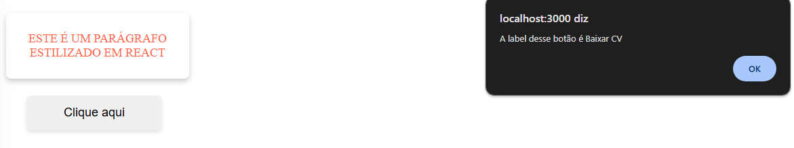

# Projeto de Desafios - DevemDobro

Este projeto foi desenvolvido como parte do curso DevemDobro e consiste em dois desafios utilizando React. 

## Desafios

### 1. Componente de Texto Colorido

- **Objetivo**: Criar um componente que renderiza um parágrafo colorido e com todas as letras em maiúsculas (uppercase).
- **Missões**:
  - Renderizar na tela um parágrafo estilizado com cor e texto em maiúsculas.
  - Utilizar props para passar o texto e a cor desejada para o componente.

### 2. Componente de Botão com Alerta

- **Objetivo**: Criar um componente Button que exibe um alerta informando a label do botão quando clicado.
- **Missões**:
  - Criar um botão que, ao ser clicado, mostra um alerta com a mensagem: "A label desse botão é Baixar CV".

## Tecnologias Usadas

- React
- JavaScript
- CSS

